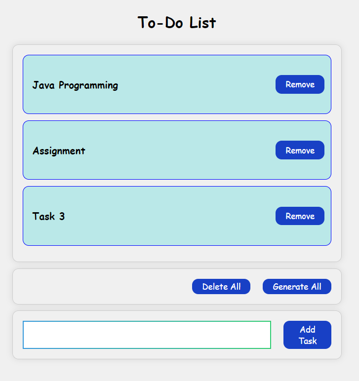

# Simple Todo List App



This is a simple todo list app built using React JS. It allows users to add and remove tasks from their todo list. The app is also responsive, making it suitable for use on various devices.

## Table of Contents

- [Demo](#demo)
- [Features](#features)
- [Getting Started](#getting-started)
    - [Prerequisites](#prerequisites)
    - [Installation](#installation)
- [Usage](#usage)
- [Contributing](#contributing)
- [License](#license)

## Demo

You can see a live demo of the app [here](link-to-live-demo).

## Features

- Add tasks to your todo list.
- Remove tasks from your todo list.
- Responsive design for various screen sizes.

## Getting Started

Follow these instructions to get the todo list app up and running on your local machine.

### Prerequisites

You need to have the following software installed on your machine:

- [Node.js](https://nodejs.org/) (v14 or higher)
- [npm](https://www.npmjs.com/) (v6 or higher)

### Installation

1. Clone this repository to your local machine:

   ```bash
   git clone https://github.com/ChathuraAbeygunawardhana/React-Todo-List.git
   ```

2. Navigate to the project directory:

   ```bash
   cd todo-list-react
   ```

3. Install the project dependencies:

   ```bash
   npm install
   ```

## Usage

To use this simple Todo List App, follow these steps:

1. **Navigate to the project directory:**

   ```bash
   cd todo-list-react
   ```

2. **Install the project dependencies:**

   ```bash
   npm install
   ```

3. **Start the development server:**

   ```bash
   npm start
   ```

4. Open your web browser and visit `http://localhost:3000` to use the app.

5. To add a task, enter the task description in the input field and click the "Add" button.

6. To remove a task, click the "Remove" button next to the task you want to delete.

## Contributing

If you would like to contribute to this project, please follow these guidelines:

1. Fork the repository.

2. Create a new branch for your feature or bug fix.

3. Make your changes and ensure that the code is well-documented.

4. Test your changes thoroughly.

5. Create a pull request with a clear description of your changes.
